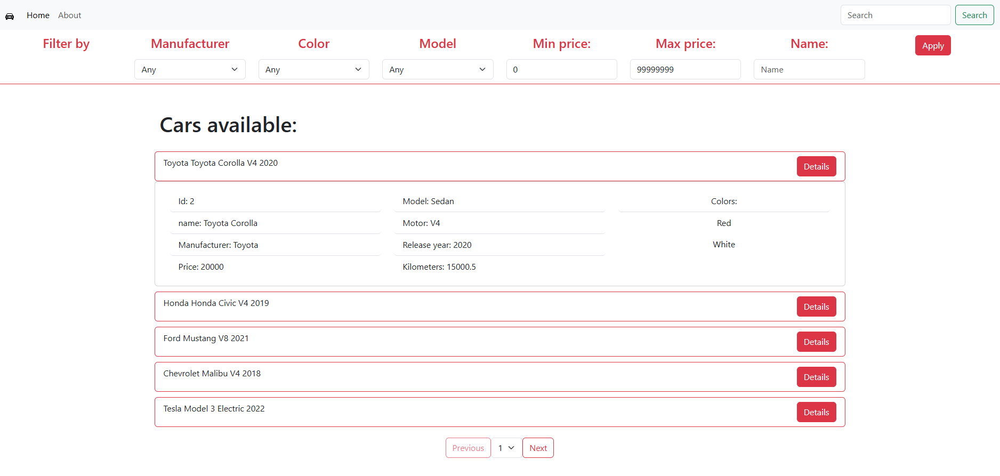

# cars-api

## Index

- [Description](#description)
- [API](#API)
- [Front-end](#Front-end)
- [TODO](#TODO)

## Description

This is a simple dealership Web Application that allows users to view a list of cars, employees, customers and sales, among with the details of each one of them. The application is divided in two parts: the Back-end and the Front-end.

The Back-end is a RESTful API built with Spring Boot and PostgreSQL as the database. The Front-end is a Angular application that consumes the API.

## API

The API has the following endpoints:

### Cars

- `/api/v1/cars?page={page}&size={size}`: GET all cars

```json
[
	{
	    "car_id": 2,
		"car_name": "Toyota Corolla",
		"model": "Sedan",
		"release_year": 2020,
		"motor": "V4",
		"kilometers": 15000.5,
		"price": 20000.0,
		"manufacturer": {
			"man_name": "Toyota",
			"country": "Japan"
		},
		"colors": [
			"Red",
			"White"
		]
	},
	{
		"car_id": 4,
		"car_name": "Honda Civic",
		"model": "Sedan",
		"release_year": 2019,
		"motor": "V4",
		"kilometers": 25000.0,
		"price": 18000.0,
		"manufacturer": {
			"man_name": "Honda",
			"country": "Japan"
		},
		"colors": [
			"Blue",
			"Black"
		]
	}
]
```

- `/api/v1/cars/{id}`: GET a car by id

```json
{
    "car_id": 2,
    "car_name": "Toyota Corolla",
    "model": "Sedan",
    "release_year": 2020,
    "motor": "V4",
    "kilometers": 15000.5,
    "price": 20000.0,
    "manufacturer": {
        "man_name": "Toyota",
        "country": "Japan"
    },
    "colors": [
        "Red",
        "White"
    ]
}
```

- `/api/v1/cars`: POST a new car

```json
{
    "car_name": "Toyota Corolla",
    "model": "Sedan",
    "release_year": 2020,
    "motor": "V4",
    "kilometers": 15000.5,
    "price": 20000.00,
    "manufacturer": {
            "manufacturer_name": "Toyota",
            "country": "Japan"
    },
    "colors": ["Red","White"]
}
```

- `/api/v1/cars/list`: POST a list of cars

```json
[
    {
        "car_name": "Toyota Corolla",
        "model": "Sedan",
        "release_year": 2020,
        "motor": "V4",
        "kilometers": 15000.5,
        "price": 20000.00,
        "manufacturer": {
            "manufacturer_name": "Toyota",
            "country": "Japan"
        },
        "colors": ["Red","White"]
    },
    {
        "car_name": "Honda Civic",
        "model": "Sedan",
        "release_year": 2019,
        "motor": "V4",
        "kilometers": 25000.0,
        "price": 18000.00,
        "manufacturer": {
            "manufacturer_name": "Honda",
            "country": "Japan"
        },
        "colors": ["Blue","Black"]
    }
]
```

- `/api/v1/cars`: PUT a car

```json
{
    "car_name": "Toyota Corolla",
    "model": "Sedan",
    "release_year": 2020,
    "motor": "V4",
    "kilometers": 15000.5,
    "price": 20000.00,
    "manufacturer": {
            "manufacturer_name": "Toyota",
            "country": "Japan"
    },
    "colors": ["Red","White"]
}
```

- `/api/v1/cars/{id}`: DELETE a car

- `/api/v1/cars/filter?page={page}&size={size}&`: GET cars by filter

    Optional parameters:
    - `manufacturer={manufacturer}`: String
    - `model={model}`: String
    - `color={color}`: String
    - `min_price={min_price}`: Double
    - `max_price={max_price}`: Double
    - `min_year={min_year}`: Integer
    - `max_year={max_year}`: Integer
    - `color={color}`: String
    - `car={car}`: String

### Employees

- `/api/v1/employees?page={page}&size={size}`: GET all employees

```json
[
	{
		"employee_id": 1,
		"first_name": "David",
		"last_name": "Brown",
		"position": "Sales Manager",
		"salary": 55000.0,
		"hire_date": "2019-04-15",
		"phone_number": "555-1111",
		"email": "david.brown@example.com"
	},
	{
		"employee_id": 2,
		"first_name": "Emma",
		"last_name": "Wilson",
		"position": "Service Technician",
		"salary": 45000.0,
		"hire_date": "2020-06-20",
		"phone_number": "555-2222",
		"email": "emma.wilson@example.com"
	}
]
```

- `/api/v1/employees/{id}`: GET an employee by id

```json
{
    "employee_id": 1,
    "first_name": "David",
    "last_name": "Brown",
    "position": "Sales Manager",
    "salary": 55000.0,
    "hire_date": "2019-04-15",
    "phone_number": "555-1111",
    "email": "david.brown@example.com"
}
```

- `/api/v1/employees`: POST a new employee

```json
{
    "first_name": "David",
    "last_name": "Brown",
    "position": "Sales Manager",
    "salary": 55000.00,
    "hire_date": "2019-04-15",
    "phone_number": "555-1111",
    "email": "david.brown@example.com"
}
```

- `api/v1/employees/list`: POST a list of employees

```json
[
    {
        "first_name": "David",
        "last_name": "Brown",
        "position": "Sales Manager",
        "salary": 55000.00,
        "hire_date": "2019-04-15",
        "phone_number": "555-1111",
        "email": "david.brown@example.com"
    },
    {
        "first_name": "Emma",
        "last_name": "Wilson",
        "position": "Service Technician",
        "salary": 45000.00,
        "hire_date": "2020-06-20",
        "phone_number": "555-2222",
        "email": "emma.wilson@example.com"
    }
]
```

- `/api/v1/employees/filter?page={page}&size={size}&`: GET employees by filter

    Optional parameters:
    - `first_name={first_name}`: String
    - `last_name={last_name}`: String
    - `position={position}`: String
    - `email={email}`: String
    - `min_salary={min_salary}`: Double
    - `max_salary={max_salary}`: Double
    - `phone_number={phone_number}`: String

### Customers

- `/api/v1/customers?page={page}&size={size}`: GET all customers

```json
[
	{
		"customer_id": 1,
		"first_name": "Alice",
		"last_name": "Johnson",
		"phone_number": "555-1234",
		"email": "alice.johnson@example.com"
	},
	{
		"customer_id": 2,
		"first_name": "Bob",
		"last_name": "Smith",
		"phone_number": "555-5678",
		"email": "bob.smith@example.com"
	}
]
```

- `/api/v1/customers/{id}`: GET a customer by id

```json
{
    "customer_id": 1,
    "first_name": "Alice",
    "last_name": "Johnson",
    "phone_number": "555-1234",
    "email": "alice.johnson@example.com"
}
```

- `/api/v1/customers`: POST a new customer

```json
{
    "first_name": "Alice",
    "last_name": "Johnson",
    "email": "alice.johnson@example.com",
    "phone_number": "555-1234"
}
```

- `/api/v1/customers/list`: POST a list of customers

```json
[
	{
		"first_name": "Bob",
		"last_name": "Smith",
		"email": "bob.smith@example.com",
		"phone_number": "555-5678"
	},
	{
		"first_name": "Charlie",
		"last_name": "Davis",
		"email": "charlie.davis@example.com",
		"phone_number": "555-9012"
	}
]
```

- `/api/v1/customers/filter?page={page}&size={size}&`: GET customers by filter

    Optional parameters:
    - `first_name={first_name}`: String
    - `last_name={last_name}`: String
    - `email={email}`: String
    - `phone_number={phone_number}`: String

### Sales

- `/api/v1/sales?page={page}&size={size}`: GET all sales

```json
[
	{
		"id": 4,
		"date": "2025-01-31",
		"sale_price": 19000.0,
		"car": {
			"car_id": 2,
			"car_name": "Toyota Corolla",
			"model": "Sedan",
			"release_year": 2020,
			"motor": "V4",
			"kilometers": 15000.5,
			"price": 20000.0,
			"manufacturer": {
				"manufacturer_id": 1,
				"manufacturer_name": "Toyota",
				"country": "Japan"
			},
			"colors": [
				{
					"color_id": 1,
					"color_name": "Red"
				},
				{
					"color_id": 2,
					"color_name": "White"
				}
			]
		},
		"customer": {
			"customer_id": 2,
			"first_name": "Bob",
			"last_name": "Smith",
			"phone_number": "555-5678",
			"email": "bob.smith@example.com"
		},
		"employee": {
			"employee_id": 1,
			"first_name": "David",
			"last_name": "Brown",
			"position": "Sales Manager",
			"salary": 55000.0,
			"hire_date": "2019-04-15",
			"phone_number": "555-1111",
			"email": "david.brown@example.com"
		}
	}
]
```

- `/api/v1/sales/{id}`: GET a sale by id

```json
{
    "id": 4,
    "date": "2025-01-31",
    "sale_price": 19000.0,
    "car": { ... },
    "customer": { ... },
    "employee": { ... }
}
```

- `/api/v1/sales`: POST a new sale

```json
{
    "date": "2025-01-31",
    "sale_price": 19000.0,
    "car_id": 2,
    "customer_id": 2,
    "employee_id": 1
}
```

- `/api/v1/sales/filter?page={page}&size={size}&`: GET sales by filter

    Optional parameters:
    - `date={date}`: String
    - `min_price={min_price}`: Double
    - `max_price={max_price}`: Double
    - `car_name={car_name}`: String
    - `customer_name={customer_name}`: String
    - `employee_name={employee_name}`: String

## Front-end

The Front-end is a Angular application that consumes the API through HTTP requests. The application has the following pages:

### Home page:


### Cars page:



### Employees page:


### Customers page:


### Sales page:


## TODO:

- [x] Add pagination
- [x] Add filters
- [x] Add async and concurrency control
- [x] Add security with authentication and authorization (backend)
- [ ] Add security with authentication and authorization (frontend)
- [ ] Add tests
- [ ] Add Docker